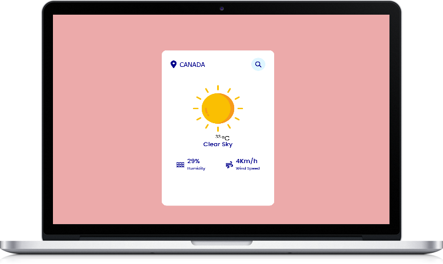
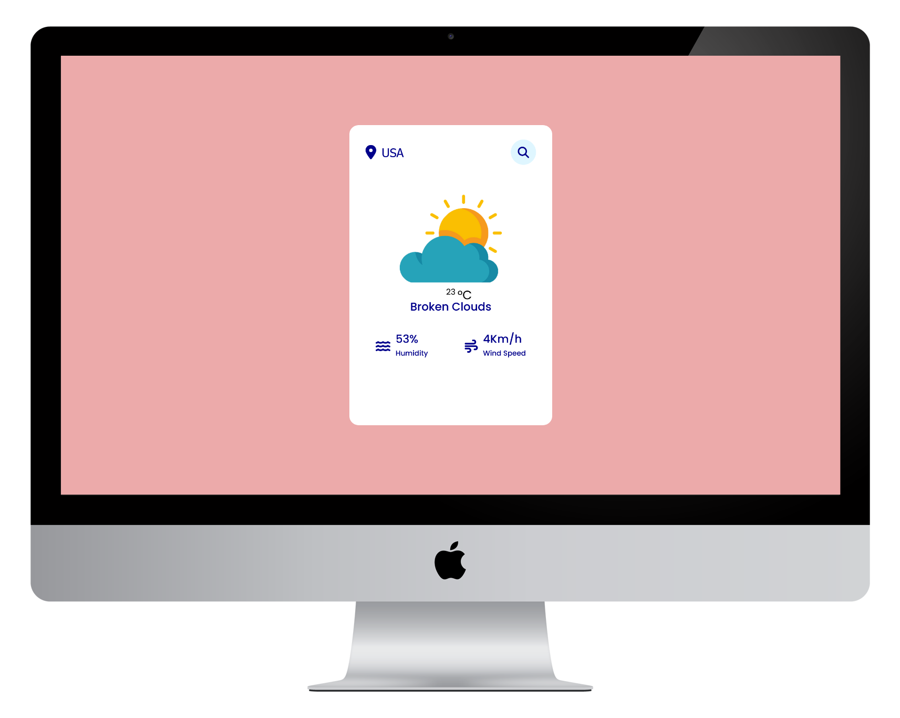

##  Weather App

## Table of contents

- [Screenshot](#screenshot)
- [Links](#links)
- [Built with](#the-solutions-with-these-tools)
- [Author](#author)

### Links

- [Live Github](https://amir-ranjbr.github.io/weatherAppSimple)

### Screenshot

## The solutions with these tools:

&nbsp;
&nbsp;

&nbsp;

## Author

- YouTube - [Weird-Code](https://www.youtube.com/@Weird-Code)
- Github - [Amir-Ranjbr](https://github.com/Amir-Ranjbr)

## Installation

Clone Repository in you system and Enjoy!😄🎉

## 🛡️ License

This project is licensed under the [MIT](LICENSE) license

## Buy me a coffee ☕

<!-- 
┌───────────────────┐              ┌──────────────────┐
│                   │              │ YT: @Weird-Code  │
│  Follow For More  │  ──────────► │                  │
│                   │              │ Git: Amir-Ranjbr │
└───────────────────┘              └──────────────────┘
 -->
